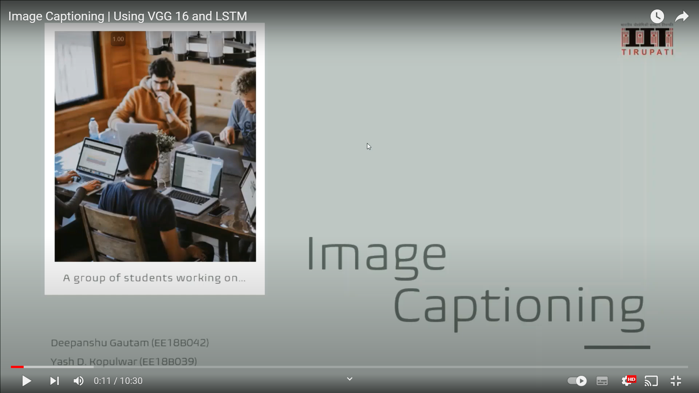
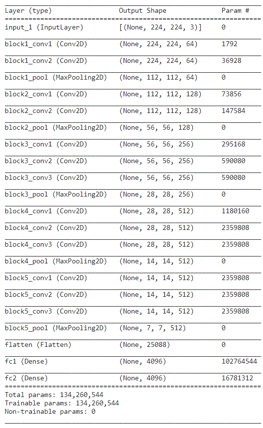
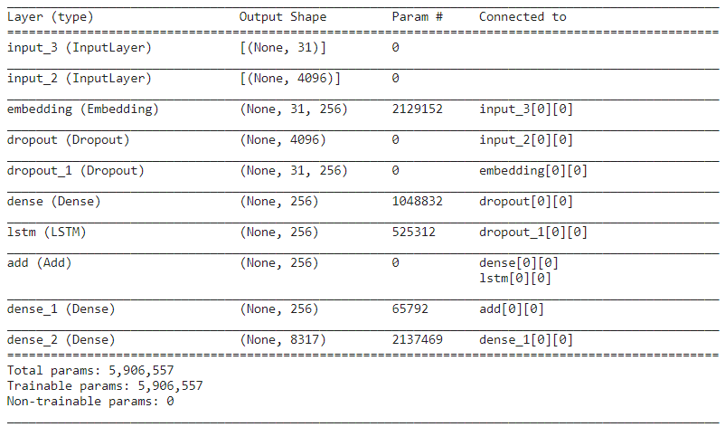

# Image Captioning
Generating image captions using encoder-decoder deep neural network

<b>Click on the image to open Youtube video</b> 

## Contents
* [Overview](#overview)
* [Motivation](#motivation)
* [Dataset](#dataset)
* [Setup](#setup)
* [Repository files](#repository-files)
* [Model](#model)
* [What did I learn](#what-did-i-learn)

## Overview
Describing an image or the surrounding environment is a very humanly attribute. It is hard for machine to describe something using an image as an image is only a matrix of numbers. This project aims to give this ability to machines using Deep Learning methods. The machine will understand the image using Convolutional Neural Network (CNN) and then explain humand in text for the description of the image using Long Short Term Memory (LSTM) model.

## Motivation
After working on projects related to both CV (Computer Vision) and NLP (Natural Language Processing), I wanted to use both side by side to solve more complex problems. New technologies are often created by merging some old technologies in a new way I knew this would be an awesome learning opportunity.

## Dataset
The dataset was downloaded from Kaggle 
Website: [Flickr 8k Dataset](https://www.kaggle.com/datasets/adityajn105/flickr8k)

About dataset: A new benchmark collection for sentence-based image description and search, consisting of 8,000 images that are each paired with five different captions which provide clear descriptions of the salient entities and events. … The images were chosen from six different Flickr groups, and tend not to contain any well-known people or locations, but were manually selected to depict a variety of scenes and situations

Glove Embeddings were downloaded from Kaggle 
Website: [Glove Embeddings (glove.6B.200d.txt)](https://www.kaggle.com/incorpes/glove6b200d)

## Setup
Performed on Kaggle Notebook

## Repository files
\_includes ----------------------------- contains images for README file
 .gitattributes ------------------------- attributes to path names for Git Large File Storage (Git LFS)
 LICENSE ------------------------------ MIT license
 README.md ------------------------- information about the project
 features.p ---------------------------- contains image features obtained from encoder for each image in dataset
 image-captioning.ipynb ------------ Python code for training Image Captioning model
 image_captioning_model.h5 ------- saved Image Captioning model
 

## Model
Architechture of the VGG16 model used as encoder 

  

Architechture of the LSTM model used as decoder 

  

## What did I learn?
* VGG16 (Pre-trained model)
* transfer learning
* encoder-decoder network
* CNN
* LSTM
* text pre-processing and cleaning
* word embeddings
